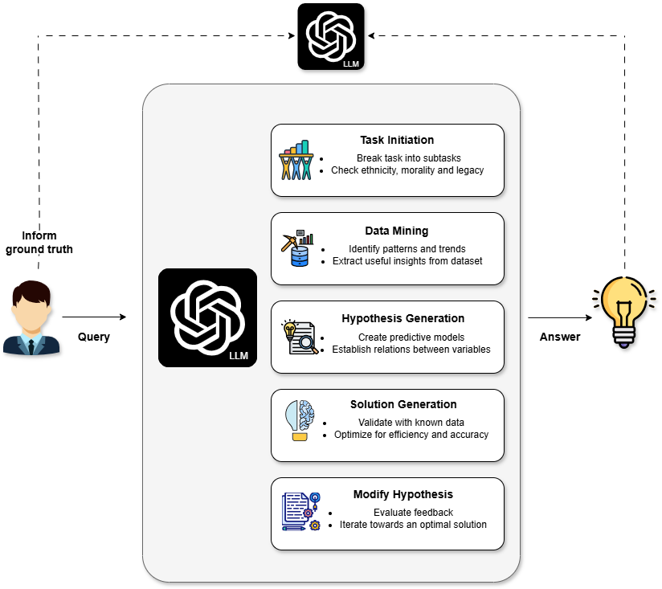

# Roundtable Policy: Compositional Large Language Model Agents Aided Scientific Discovery and Proposal

### [![][project-icon]][project-page] | [![][arxiv-icon]][arxiv-paper]

[project-icon]: https://img.shields.io/badge/🌍-Project%20Page-green
[arxiv-icon]: https://img.shields.io/badge/arXiv-2206.01714-b31b1b

<!-- [![][colab]][composable-demo][colab]: https://colab.research.google.com/assets/colab-badge.svg -->
<!-- [![][huggingface]][huggingface-demo][huggingface]: https://img.shields.io/badge/%F0%9F%A4%97%20Hugging%20Face-Spaces-blue -->


[project-page]: https://energy-based-model.github.io/Compositional-Visual-Generation-with-Composable-Diffusion-Models/
[arxiv-paper]: https://arxiv.org/pdf/2206.01714.pdf
[composable-demo]: https://colab.research.google.com/github/energy-based-model/Compositional-Visual-Generation-with-Composable-Diffusion-Models-PyTorch/blob/main/notebooks/demo.ipynb
[huggingface-demo]: https://huggingface.co/spaces/Shuang59/Composable-Diffusion


## Contributors
[Yu Yao](https://www.linkedin.com/in/yu-yao-8599b5265/) <sup>1*</sup>,
[Jiayi Dong](https://www.linkedin.com/in/jiayi-dong-6a2a6b26b/) <sup>2*</sup>,
[Yilun Du](https://scholar.google.com/citations?user=GRMMc_MAAAAJ&hl=en) <sup>3</sup>,
[Yang Yang](https://scholar.google.com/citations?user=ceCfTvcAAAAJ&hl=en) <sup>2</sup>,
[Ju Li](https://scholar.google.com/citations?user=SHVhdhoAAAAJ&hl=en) <sup>1</sup>

<sup>*</sup> Equal Contribution  
<sup>1</sup> Massachusetts Institute of Technology    
<sup>2</sup> University of California, Los Angeles  
<sup>3</sup> Harvard University  


## Updates:
- 2025/02/17: Github repo set up
- 2925/02/22: Project release

## Table of Contents
- [Overview](#Overview-of-Roundtable-Policy)
- [Benchmark](#benchmark)
- [Licensing Information](#licensing-information)
- [Disclaimer](#disclaimer)
- [Citation](#citation) 

## Overview of Roundtable Policy

<p align="center">
  
  
</p>


Recent advances in large language models (LLMs) have demonstrated their remarkable potential in a wide range of scientific tasks, including prediction and generative analyses. However, it remains challenging for a single model to excel at all tasks simultaneously—some LLMs specialize in prediction accuracy while others are more adept at generating coherent, context-rich text. To address this limitation, we propose a multi-LLM agent framework for perovskite solar cell property prediction and decision-making. In our approach, multiple LLMs—each treated as an independent “expert”—are trained on the same multimodal dataset but leverage their unique strengths to produce diverse outputs. These outputs are then integrated through a “roundtable discussion,” where an aggregator or “judge” model (or a human operator) compiles, compares, and merges each expert’s input. By employing techniques such as majority voting and weighted consensus, the final decision is informed by the collective wisdom of all experts. We demonstrate that this ensemble strategy outperforms single-model baselines on both predictive and generative tasks, with a particular focus on key perovskite solar cell parameters. This framework is not only simple and efficient to implement—requiring primarily CSV-based data preprocessing and straightforward aggregator logic—but also highly adaptable to broader materials discovery and design challenges, thereby paving the way for future integration into more complex automated research systems.

## Benchmark

To prevent benchmark data contamination, we only provide the annotation sheet on [Huggingface](https://huggingface.co/datasets/osunlp/ScienceAgentBench), which includes all necessary *inputs* to run an agent.

To evaluate the agent outcomes, i.e. generated code, please download the full benchmark [here](https://buckeyemailosu-my.sharepoint.com/:u:/g/personal/chen_8336_buckeyemail_osu_edu/EQuA6uJ3CtRHvRfZ2GiN1tYBRVJE4DSUD10MW61fr7HuSQ?e=sCBegG) and unzip it with password `scienceagentbench`.


## Licensing Information

Most tasks in '''Roundtable Policy: Compositional Large Language Model Agents Aided Scientific Discovery and Proposal''' is licensed under a <a rel="license" href="http://creativecommons.org/licenses/by/4.0/">Creative Commons Attribution 4.0 International License</a>.

Code under this repo is licensed under a MIT License.

## Disclaimer

Our benchmark is constructed by adapting open-source code and data, to which we respect their creators' ownership and intellectual property. In the Appendix of our paper, we have made our best effort to cite the original papers, list the repositories, and provide their licenses.<\br>
We give sincere acknowledgement to the following copyrighted repositories:

[rasterio/rasterio](https://github.com/rasterio/rasterio)<br>
[hackingmaterials/matminer](https://github.com/hackingmaterials/matminer)<br>
[ScienceAgentBench](https://github.com/OSU-NLP-Group/ScienceAgentBench)<br>

We welcome requests from the original authors to modify or remove relevant tasks related to those two repositories if needed.

## Citation

If you find our code and data useful, please cite our paper:

```
@article{yao2025roundtable1.0,
      title={Roundtable Policy: Compositional Large Language Model Agents Aided Scientific Discovery and Proposal}, 
      author={Yu Yao and Jiayi Dong and Yilun Du and Yang Yang and Ju Li},
      journal={arXiv preprint arXiv:2502.xxxxx},
      year={2025}
}
```
