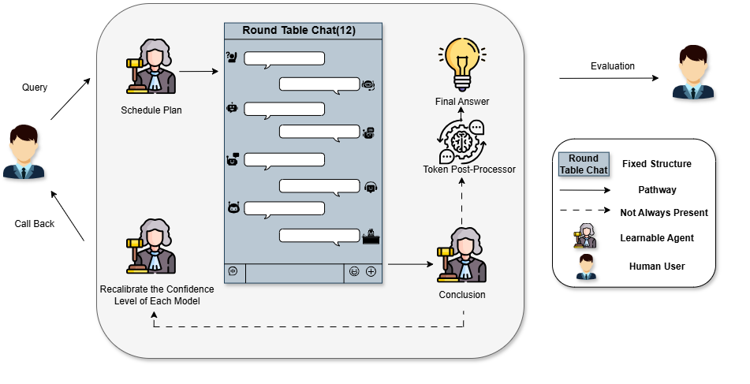

# **Roundtable Policy: Compositional Large Language Model Agents Aided Scientific Discovery and Proposal Generation**

### [![][project-icon]][project-page] | [![][arxiv-icon]][arxiv-paper]

[project-icon]: https://img.shields.io/badge/🌍-Project%20Page-green  
[arxiv-icon]: https://img.shields.io/badge/arXiv-2502.xxxxx-b31b1b

[project-page]: https://yuyao-mit.github.io/roundtable/project_page/
[arxiv-paper]: https://arxiv.org/abs/2311.10889  

## Contributors

[Yu Yao](https://www.linkedin.com/in/yu-yao-8599b5265/) <sup>1*</sup>
[Jiayi Dong](https://www.linkedin.com/in/jiayi-dong-6a2a6b26b/) <sup>2*</sup>
[Ju Li](https://scholar.google.com/citations?user=SHVhdhoAAAAJ&hl=en) <sup>1</sup>
[Yang Yang](https://scholar.google.com/citations?user=ceCfTvcAAAAJ&hl=en) <sup>2</sup>
[Yilun Du](https://scholar.google.com/citations?user=GRMMc_MAAAAJ&hl=en) <sup>3</sup>


<sup>*</sup> Equal Contribution  
<sup>1</sup> Massachusetts Institute of Technology   
<sup>2</sup> University of California, Los Angeles   
<sup>3</sup> Harvard University  

---

## Updates
- **2025/02/17**: Initial repository setup  
- **2025/02/22**: Project release  
- **2025/02/24**: Demo release

---

## Table of Contents
1. [Overview](#overview-of-roundtable-policy)  
2. [Quick Setup](#quick-setup)  
3. [Data Availability](#data-availability)  
4. [Licensing Information](#licensing-information)  
5. [Disclaimer](#disclaimer)  
6. [Citation](#citation)  

---

## Overview of ```Roundtable Policy```

<p align="center">
  
  
</p>

Recent advancements in large language models (LLMs) have showcased their remarkable potential across various scientific domains, including predictive modeling and generative analysis. However, no single LLM excels across all tasks—some are optimized for high-precision numerical predictions, while others specialize in generating coherent, context-rich text.

To overcome this limitation, we introduce **Roundtable Policy**, a multi-LLM agent framework designed for scientific discovery and proposal generation. Our approach is centered around two key components:

- **Arbitrator** – An intelligent aggregator that systematically integrates model outputs.
- **Confidence Weight Table** – A dynamic, trainable mechanism that optimally weights contributions from different expert models.

### Framework & Implementation

In our framework, multiple LLMs function as independent “experts,” each trained on the same multimodal dataset while leveraging their specialized capabilities to generate diverse outputs. These responses undergo a **roundtable discussion**, where the **Arbitrator** compiles, compares, and integrates each expert’s insights. The final decision is then refined using the **Confidence Weight Table**, ensuring optimal fusion of expertise.

Unlike traditional LLM pipelines that rely heavily on extensive parameter tuning, our **Confidence Weight Table** is computationally lightweight yet trainable, allowing for rapid adaptation to new tasks while maintaining high performance.

### Benchmarking & Results

To evaluate our framework, we benchmarked it against single-model baselines on perovskite solar cell property prediction and decision-making tasks. Our ensemble approach consistently outperforms single-model baselines across both predictive and generative tasks. Additionally, it achieves state-of-the-art performance across multiple input modalities, demonstrating superior robustness and adaptability in scientific applications.

---

## Quick Setup

Below are the general steps to get started with Roundtable Policy on your local machine:

1. **Clone the repository**  
   ```bash
   git clone https://github.com/yuyao-mit/roundtable.git
   cd roundtable
   ```

2. **Set up the environment**  
   - Ensure you have Python 3.8+ installed.  
   - Install required Python packages:
     ```bash
     pip install -r requirements.txt
     ```
   - Some external dependencies, if you plan to test them with our code, may require platform-specific installation steps. Please consult their official documentation for further guidance.

3. **Configure the dataset**  
   - The primary dataset is provided on the [![][cloud-storage-icon]][google-drive].  
   - However, we also provide an alternative to generate your own data.
   - For multitask `qk_pair`, you can follow the following, e.g. create 1000 rounds of `qk_pair`:
     ```bash
     cd src/
     python data_multitask_gen.py --rounds 100
     ```
   - For single task, you can follow the following:
     ```bash
     python data_singletask_gen.py --rounds 1000
     ```
4. **Generate responses with different LLMs**     
   - Before you run the test.py, please ensure that your `OPENAI_API_KEY` is properly exported.
     ```bash
     export OPENAI_API_KEY="your_api_key_here"
     python openai_multitask.py --model "gpt-4o" --player "player_00001" --retries 3 --delay 2
     ```

5. **Update the confidence weight table**     
   - Execute:
     ```bash
     python update_confidence_weight_table.py --arbitrator "gpt-o1"
     ```
   - The demo will showcase how multiple LLM “experts” generate and compare their predictions, with the **Arbitrator** and **Confidence Weight Table** finalizing results.

5. **Evaluate the performance among models**  
   - Use the evaluation script to compare single-model baselines vs. the Roundtable Policy pipeline:
     ```bash
     python evaluate.py
     ```
   - Results will be saved in `results/` by default, summarizing both predictive and generative benchmarks.

---
## Data Availability

The entire dataset is available at the [![][cloud-storage-icon]][google-drive]

[cloud-storage-icon]: https://img.shields.io/badge/☁️-Google%20Drive-blue  
[google-drive]: https://drive.google.com/drive/folders/1cTvyyiuc1ZjqXCFztqtj3ByqxuPZTQi4

We also acknowledge the following copyrighted repositories that supported our dataset collection process:

- [k2](https://github.com/davendw49/k2)  
- [Mol-Instructions](https://github.com/zjunlp/Mol-Instructions)
- [grade-school-math](https://github.com/openai/grade-school-math)

We welcome requests from the original authors to modify or remove relevant tasks related to these repositories if needed.

---

## Licensing Information

Most tasks in **Roundtable Policy: Compositional Large Language Model Agents Aided Scientific Discovery and Proposal** are licensed under a [Creative Commons Attribution 4.0 International License](http://creativecommons.org/licenses/by/4.0/).

The code in this repository is licensed under the [MIT License](LICENSE).

---

## Disclaimer

This software is intended for research and educational purposes. While we strive for accuracy and reliability, **Roundtable Policy** is provided “as is,” without warranty of any kind. Users are responsible for assessing its suitability for their specific use cases and complying with all applicable regulations.

---

## Citation

```bibtex
@article{yao2025roundtable1.0,
  title={Roundtable Policy: Compositional Large Language Model Agents Aided Scientific Discovery and Proposal},
  author={Yu Yao and Jiayi Dong and Ju Li and Yang Yang and Yilun Du},
  journal={arXiv preprint arXiv:2502.xxxxx},
  year={2025}
}
```
