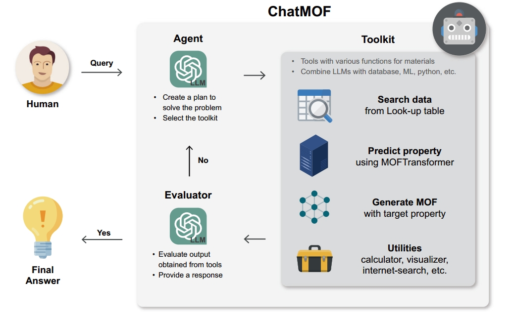

# Roundtable Policy: Compositional Large Language Model Agents Aided Scientific Discovery and Proposal

### [![][project-icon]][project-page] | [![][arxiv-icon]][arxiv-paper] | [![][colab]][composable-demo] | [![][huggingface]][huggingface-demo]

[project-icon]: https://img.shields.io/badge/🌍-Project%20Page-green
[arxiv-icon]: https://img.shields.io/badge/arXiv-2206.01714-b31b1b
[colab]: https://colab.research.google.com/assets/colab-badge.svg
[huggingface]: https://img.shields.io/badge/%F0%9F%A4%97%20Hugging%20Face-Spaces-blue

[project-page]: https://energy-based-model.github.io/Compositional-Visual-Generation-with-Composable-Diffusion-Models/
[arxiv-paper]: https://arxiv.org/pdf/2206.01714.pdf
[composable-demo]: https://colab.research.google.com/github/energy-based-model/Compositional-Visual-Generation-with-Composable-Diffusion-Models-PyTorch/blob/main/notebooks/demo.ipynb
[huggingface-demo]: https://huggingface.co/spaces/Shuang59/Composable-Diffusion


## Authors and Affiliations
[Yu Yao](https://www.linkedin.com/in/yu-yao-8599b5265/) <sup>1*</sup>,
[Jiayi Dong](https://www.linkedin.com/in/jiayi-dong-6a2a6b26b/) <sup>2*</sup>,
[Yilun Du](https://scholar.google.com/citations?user=GRMMc_MAAAAJ&hl=en) <sup>3</sup>,
[Yang Yang](https://scholar.google.com/citations?user=ceCfTvcAAAAJ&hl=en) <sup>2</sup>,
[Ju Li](https://scholar.google.com/citations?user=SHVhdhoAAAAJ&hl=en) <sup>1</sup>

<sup>*</sup> Equal Contribution  
<sup>1</sup> Massachusetts Institute of Technology    
<sup>2</sup> University of California, Los Angeles  
<sup>3</sup> Harvard University  


## Updates:
- 2025/02/17: Github repo set up

## Table of Contents
- [Overview](#Overview-of-ROUNDTABLE-POLICY)
- [Benchmark](#benchmark)
- [Setup](#setup)
- [Code Generation with Agents](#code-generation-with-agents)
- [Evaluation of Generated Code](#evaluation-of-generated-code)
- [Licensing Information](#licensing-information)
- [Disclaimer](#disclaimer)
- [Citation](#citation) 

## Overview of ROUNDTABLE POLICY

<p align="center">
  
  
</p>


Recent advances in large language models (LLMs) have demonstrated their remarkable potential in a wide range of scientific tasks, including prediction and generative analyses. However, it remains challenging for a single model to excel at all tasks simultaneously—some LLMs specialize in prediction accuracy while others are more adept at generating coherent, context-rich text. To address this limitation, we propose a multi-LLM agent framework for perovskite solar cell property prediction and decision-making. In our approach, multiple LLMs—each treated as an independent “expert”—are trained on the same multimodal dataset but leverage their unique strengths to produce diverse outputs. These outputs are then integrated through a “roundtable discussion,” where an aggregator or “judge” model (or a human operator) compiles, compares, and merges each expert’s input. By employing techniques such as majority voting and weighted consensus, the final decision is informed by the collective wisdom of all experts. We demonstrate that this ensemble strategy outperforms single-model baselines on both predictive and generative tasks, with a particular focus on key perovskite solar cell parameters. This framework is not only simple and efficient to implement—requiring primarily CSV-based data preprocessing and straightforward aggregator logic—but also highly adaptable to broader materials discovery and design challenges, thereby paving the way for future integration into more complex automated research systems.

## Benchmark

To prevent benchmark data contamination, we only provide the annotation sheet on [Huggingface](https://huggingface.co/datasets/osunlp/ScienceAgentBench), which includes all necessary *inputs* to run an agent.

To evaluate the agent outcomes, i.e. generated code, please download the full benchmark [here](https://buckeyemailosu-my.sharepoint.com/:u:/g/personal/chen_8336_buckeyemail_osu_edu/EQuA6uJ3CtRHvRfZ2GiN1tYBRVJE4DSUD10MW61fr7HuSQ?e=sCBegG) and unzip it with password `scienceagentbench`.

**Please DO NOT redistribute the unzipped data files online.**

After downloading and unzipping the full benchmark under this repository, the directory structure should look like this:
```
|-- ScienceAgentBench/
|---- benchmark/
|------ datasets/
|-------- ...
|------ eval_programs/
|-------- ...
|------ gold_programs/
|-------- ...
|------ scoring_rubrics/
|-------- ...
|---- engine/
|------ ...
|---- agent.py
|---- ...
```

## Setup

### Environment

To start, please create a conda environment and install the necessary packages as follows:
```
conda create -n roundtable python=3.10 pip setuptools wheel
conda activate roundtable
pip install -r requirements.txt
```

Then, please set the `PYTHONPATH` variable to consider relative imports of local programs:
```
export PYTHONPATH=.
```

Additionally, to run the self-debug agent and evaluate generated code, we also need to create another environment `sci-agent-eval`. This environment leverages `pip-tools` to update its package installations automatically for different tasks.
```
conda create -n roundtable-eval python=3.10 pip setuptools wheel
conda activate roundtable-eval
pip install pip-tools
conda deactivate
```
After installing `pip-tools`, please deactivate the environment. We need to keep `sci-agent-eval` clean and will only work in `sci-agent`.

### LLM Access

We currently support two kinds of LLM engines.
To use OpenAI models (gpt-4o and o1-preview), please configure your bash shell with your OpenAI key:
```
export OPENAI_API_KEY={YOUR_OPENAI_KEY}
```
To use other LLMs (llama-3.1, mistral, and claude) on Amazon Bedrock, please setup your AWS configuration (`~/.aws/config`) as follows:
```
[default]
aws_access_key_id = {YOUR_AWS_ID}
aws_secret_access_key = {YOUR_AWS_KEY}
region=us-west-2
```

## Code Generation with Agents

### Direct Prompting and Self-Debug
You can run the agents with the following command:
```
python -u run_infer.py \
    --llm_engine_name {MODEL_NAME} \
    --log_fname {LOG_FNAME}
    [--use_knowledge]
    [--use_self_debug]
```
- `llm_engine_name`: name of base LLM on OpenAI or Amazon Bedrock.
- `log_fname`: your customized log file (in JSONL) name to store agent trajectories and costs, e.g. `claude_self_debug.jsonl`.
- `use_knowledge`: whether to use expert-provided knowledge or not.
- `use_self_debug`: whether to use self-debug or not (direct prompting by default).

## Evaluation of Generated Code

### Extract Code Files from Agent Logs
To evaluate the agents or re-run evaluation of other agents, you can extract the code files automatically from their logs:
```
python -u recover_pred_from_log.py \
    --log_fname {LOG_FNAME}
    [--is_opendevin]
```
- `log_fname`: the log file (in JSONL) that stores the agent trajectories, e.g. `claude_self_debug.jsonl`.
- `is_opendevin`: whether the log file is for an OpenHands agent or not.

### Evaluating Code Files

We provide two alternative ways to evaluate the generated code files: use dockerized evaluation (recommended) if [docker](https://docs.docker.com/desktop/) is available on your machine; otherwise, use direct evaluation.

**Dockerized Evaluation (Recommended)**

Adapted from [SWE-bench](https://github.com/swe-bench/SWE-bench), the dockerized evaluation supports automatical environment setup and parallel execution. Run the following commands:

```bash
pip install docker  # install Docker SDK for Python

export OPENAI_API_KEY={YOUR_OPENAI_KEY}
python -m evaluation.harness.run_evaluation \
    --benchmark_path benchmark \
    --pred_program_path pred_programs \
    --log_fname self_debug_eval.jsonl \
    --run_id 1
```

Mandatory arguments:
- `benchmark_path`: the path to the benchmark folder.
- `pred_program_path`: the path to the predicted program folder. You may first use `python recover_pred_from_log.py` to extract all the pred_programs and then specify the path.
- `log_fname`: your customized log file (in JSONL) to store the evaluation results, e.g. `claude_self_debug_eval.jsonl`.
- `run_id`: an indicator of this run, and you could set it arbitrarily. If not specified, all unevaluated instances will be evaluated.

Optional arguments:
- `cache_level`: the level of cached docker images, where the values can be one of `none`, `base`, and `instance`. Default `base`.
- `max_workers`: the CPU workers for parallel execution. Default `4`.
- `force_rebuild`: a True-or-False indicator of whether to rebuild all images regardless of their existence. Default `False`.
- `instance_ids`: the place to designate instances to run. If not set, run all instances.

Check out [this doc](https://github.com/OSU-NLP-Group/ScienceAgentBench/tree/main/docs/20250110_docker) for more details.

**Direct Evaluation**

The following commands run the evaluation without docker, one instance at a time:
```
export OPENAI_API_KEY={YOUR_OPENAI_KEY}
python -u run_eval.py \
    --log_fname {EVAL_LOG_FNAME}
```
- `log_fname`: your customized log file (in JSONL) to store the evaluation results, e.g. `claude_self_debug_eval.jsonl`.
A valid OpenAI API key is required since our evaluation leverages GPT-4o to judge output visualizations.

### Metrics Calculation
To report the metric numbers, you can run:
```
python calculate_metrics.py \
    --run_logs {LOG_FNAME_1} \
    --run_logs {LOG_FNAME_2} \
    --run_logs {LOG_FNAME_3} \
    --eval_logs {EVAL_LOG_FNAME_1} \
    --eval_logs {EVAL_LOG_FNAME_2} \
    --eval_logs {EVAL_LOG_FNAME_3}
```
- `run_logs`: log files (in JSONL) that store the agent trajectories and costs, e.g. `claude_self_debug.jsonl`.
- `eval_logs`: log files (in JSONL) that store the evaluation results, e.g. `claude_self_debug_eval.jsonl`.


## Licensing Information

Most tasks in '''ROUNDTABLE POLICY: COMPOSITIONAL LARGE LANGUAGE AGENTS AIDED SCIENTIFIC DISCOVERY AND PROPOSAL''' is licensed under a <a rel="license" href="http://creativecommons.org/licenses/by/4.0/">Creative Commons Attribution 4.0 International License</a>.

Code under this repo is licensed under a MIT License.

## Disclaimer

Our benchmark is constructed by adapting open-source code and data, to which we respect their creators' ownership and intellectual property. In the Appendix of our paper, we have made our best effort to cite the original papers, list the repositories, and provide their licenses.<\br>
We give sincere acknowledgement to the following copyrighted repositories:

[rasterio/rasterio](https://github.com/rasterio/rasterio)<br>
[hackingmaterials/matminer](https://github.com/hackingmaterials/matminer)<br>
[ScienceAgentBench](https://github.com/OSU-NLP-Group/ScienceAgentBench)<br>

We welcome requests from the original authors to modify or remove relevant tasks related to those two repositories if needed.

## Citation

If you find our code and data useful, please cite our paper:

```
@article{yao2025roundtable1.0,
      title={ROUNDTABLE POLICY: COMPOSITIONAL LARGE LANGUAGE AGENTS AIDED SCIENTIFIC DISCOVERY AND PROPOSAL}, 
      author={Yu Yao and Jiayi Dong and Yilun Du and Yang Yang and Ju Li},
      journal={arXiv preprint arXiv:2305.14325},
      year={2025}
}
```
