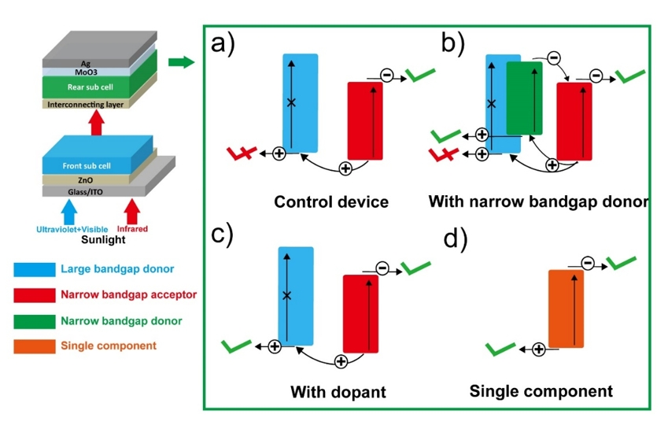

# Research Proposal on Tandem Solar Cells

## 1. Objectives and Overview

In the recent years, organic photovoltaics (OPVs) have drawn tremendous attention due to their combined advantages of low-cost, light-weight, flexibility, and ease of large-area fabrication.[1-3] As a promising candidate for next-generation renewable-energy technology, OPVs have developed rapidly in the last decade, with record power conversion efficiencies (PCEs) increasing from 7% to 17%.[4] To overcome the limitations (both electrical and optical losses) of single-junction OPVs, people have recently focused on tandem-junction OPVs.[5-7] Tandem-junction OPVs, comprised of two or more sub-cells stacked together, have potential advantages of: 1) reduced hot carrier thermal losses for higher open-circuit voltage (VOC); 2) improved photon utilization efficiency for higher short-circuit current density (JSC); and 3) reduced monomolecular/bimolecular charge recombination for higher fill factor (FF). The PCEs of tandem-junction OPVs have been increased to 15-17% recently with new non-fullerene acceptors.[8] Despite the advantages mentioned above, the PCEs of the tandem-junction OPVs are still just comparable with that of the single-junction OPVs, which negates the original purpose of developing tandem-junction OPVs. 

A typical two-junction inorganic tandem solar cell is composed of two sub-cells with complementary absorption ranges, such that the overall absorption is broadened, and the VOCs are added up with minimum loss. The major difference between inorganic cells and OPVs is that in OPVs, organic absorber layers consist of donors and acceptors to ensure sufficient exciton dissociation. These layers usually have different absorption spectra; thus, the absorption range of a single OPV cell is already broadened. The major issue limiting the PCEs of tandem-junction OPVs arises from this distinction. In a tandem organic photovoltaic cell, the front sub-cell consists of large bandgap materials, whereas the rear sub-cell is generally comprised of a narrow bandgap acceptor for infrared (IR) absorption and a large bandgap donor to realize a high VOC. Unfortunately, most of the ultraviolet (UV)-visible part of photons are absorbed by the front sub-cell; as a result, in the rear sub cell, the number of excitons generated in the large bandgap donor is reduced significantly. For this reason, the conductivity and the hole-transporting mobility of the rear sub cell are dramatically limited, which is regarded as the main reason that the PCEs of tandem-junction OPVs are not as high as expected. In our preliminary studies, we compared the performance of a single-junction OPV with the active layer of PBDB-T[9]/Y1[10] and a tandem-junction OPV with PBDB-T/ITIC-Th3[11] as the front sub cell and PBDB-T/Y1 as the rear sub cell. The single-junction OPV has an averaged PCE of 13.4%, while the tandem-junction OPV only has an averaged PCE of 13.2%, which is even lower than the single-junction one. 

However, more concrete evidence is needed to demonstrate that broad front sub-cell absorption is the main reason that limits the performance of tandem-junction OPVs. Furthermore, we need to systematically study how much PCE loss is caused from this problem and what the effective strategies to resolve the lack of excitons generated on the large bandgap donors of the rear sub cell are. To overcome this bottleneck of tandem-junction OPVs, more systematic analysis should be applied. Starting with it, improvements to further increase the PCEs of tandem-junction OPVs can be made, which hopefully, can make them competitive with inorganic photovoltaics. Our final goal of this project is to successfully fabricate tandem-junction OPVs with $J_{SC}$ of $17mA \cdot cm^{-2}$ and PCE of 25%.

## 2. Approach and Scientific Rationale

### 2.1. Mechanism exploration of the influence of the front sub cells on the rear sub cells.

In preliminary studies, to prove the mechanism that the number of excitons in the rear cell reducing dramatically due to most of the UV-visible photons being absorbed by the front sub cell,  an experiment was designed that uses the front cell (glass/indium tin oxide (ITO)/ZnO/PBDB-T: ITIC-Th3/molybdenum trioxide (MoO3)/Mix-PEDOT: PSS) as a filter. Conductivity measurements of the PBDB-T/Y1 active layer under illumination (AM 1.5 G solar simulator, 100 $mW\cdot cm^{-2}$) shows that the conductivity reduces from 4.0 to 2.8 S/cm after the employment of the filter, which also implies the reduction of the charge carrier density. Next, charge dynamics (exciton generation and dissociation, charge transportation) should be studied more deeply. The impact that the front sub-cell absorption will have on the exciton generation and dissociation, as well as the density of charge carriers and the conductivity of the rear sub-cell, needs to be understood.  

#### 2.1.1. Detection of exciton generation. 

We plan to use time-resolved terahertz (THz) spectroscopy to obtain the exciton quantum yield of the rear sub cell. The exciton quantum yield reflects the device’s ability to convert the absorbed photons into excitons. The photoconductivity of the active layer of the rear sub-cell changes when an ultrafast pump pulse is used to excite it, which will affect the response of the THz signal when THz radiation is used as a probe pulse.[12,13] The change of photoconductivity ($∆σ$) in the active layer is related to the exciton quantum yield ($φ$) through the following equation:[14]
$$
\frac{\Delta\sigma}{n_{exc}e}=\varphi \times (\mu_e+\mu_h)=-\frac{\Delta E(\omega)}{E_0(\omega)}\times\frac{\varepsilon_{0}c}{Fe}\times\frac{1}{1-e^{-\alpha d}}
$$
where $n_{exc}$ is photogenerated charge density in the semiconductor, e is the elementary charge, $μ_{e}$ and $μ_{h}$ are the mobilities of electrons and holes in the sample, respectively, $∆E$ is the photo-induced change in the transmitted THz electric field spectrum, $E_0$ is the spectrum of the THz electric field transmitted through the sample without excitation, ω is the THz probe frequency, $ε_0$ is permittivity of vacuum, $c$ is speed of light, $F$ is the pump fluence, $α$ is the absorption coefficient, and $d$ is the thickness of the sample. By using time-resolved THz spectroscopy, we can analyze the ability of the active layer of rear sub-cell to convert the absorbed photon into excitons and obtain carrier mobility of the active layer from the response of the THz signal. Moreover, we plan to make films with the acceptors and donors separately to further obtain their individual exciton generation dynamics.
#### 2.1.2. Investigation of exciton dissociation. 

We plan to further investigate the exciton dissociation at the interface of acceptors and donors of rear sub-cells by time-resolved two-photon photoemission spectroscopy (TR-TPPE) technique, which can resolve charge transfer states with different binding energies.[15,16] The technique utilizes femtosecond to picosecond laser pulses in order to first photoexcite an electron. After a time delay, the excited electron is photoemitted into a free electron state by a second pulse. The kinetic energy and the emission angle of the photoelectron are measured in an electron energy analyzer.[17] 

For the active layers of the rear sub-cells, we plan to apply an ultra high-vacuum (UHV) environment to perform TR-TPPE and ultraviolet photoelectron spectroscopy (UPS) experiments. UPS can be used to determine the alignment of the highest occupied molecular orbital (HOMO) level, while TR-TPPE can be used to determine the charge transfer rate and the cooling dynamics of hot charge transfer excitons. In the TR-TPPE experiment, the active layers will be excited by visible pump laser pulses with a photon energy which will resonantly excite the S1 state of the layers. The photoexcited electrons will be ionized by a probe beam. The kinetic energy of the emitted electrons will be measured by an electron analyzer, which will be used to calculate the energy of the excited states. Both the energy and the population (signal intensity) of the excited states can be determined from a TR-TPPE spectrum.[18] In this case, we can obtain the different energy states in the active layer and the corresponding exciton dissociation efficiency of the rear sub-cells. Besides, we can apply TR-TPPE to films with only donors or acceptors to further analyze the effects of the rear sub-cell components.

#### 2.1.3. Conductivity and charge carrier density measurement. 

Besides the direct conductivity measurement from the I-V curves of the rear cells mentioned before, we can connect the rear sub-cells to an external circuit to measure its conductivity while it is under the illumination with and without front cell filters. Moreover, we can also apply Hall measurements on the rear cells and figure out how the front sub-cells can influence the charge carrier density and the mobility of the rear cells.

### 2.2. Approach to ensure sufficient photo-generated holes in the rear sub cell.

**Figure 1.** Device structure of tandem-junction OPVs and proposed exciton generation/dissociation and charge transportation mechanisms in the rear sub cells.

#### 2.2.1. Introduction of a third component of an infrared-absorbing polymer donor into the rear cells.
In preliminary studies, we have tried to employ a small amount of IR-absorbing polymer donor (PDPP2T-TT[19] with bandgap of 1.4 eV as the third component in the active layer previously consisting of PBDB-T9 (polymer donor with bandgap of 1.8 eV)/Y110 (non-fullerene acceptor with bandgap of 1.4 eV). When using this ternary blend (PBDB-T/PDPP2T-TT/Y1) active layer in the rear sub-cell, although most UV-visible photons are still absorbed by the front sub cell which reduces exciton generation in large bandgap donor PBDB-T, additional excitons may be generated in the IR-absorbing donor PDPP2T-TT. This may provide a second hole generation and transportation mechanism to minimize the detrimental effect of reduced hole-transport mobility of the donor PBDB-T. As a comparison, tandem-junction OPVs were fabricated with identical front sub-cell (PBDB-T/ITIC-Th311) but different rear sub-cells (PBDB-T/Y1 binary or PBDB-T/PDPP2T-TT/Y1 ternary). Results showed that the $J_{SC}$ of the tandem-junction OPVs employing ternary rear sub-cells was significantly enhanced from 10.3 to 11.7 $mA/cm^{2}$ while retaining VOC and FF, resulting in an enhanced PCE.

#### 2.2.2. Employing dopants in the rear sub-cells to realize higher conductivity. 
In addition to using a narrow bandgap donor as the third component in the active layer of rear sub cells, the strategy of employing dopants to enhance the conductivity can be considered (Figure 1c). Some p-type dopants such as tetraphenylfluoroborate (TPFB), tetrafluoroborate (BF4), and 2,3,5,6-tetrafl uoro-7,7,8,8-tetracyanoquinodimethane (F4-TCNQ) are promising candidates. When employing these p-type dopants in the active layer of the rear sub cell, although most UV-visible photons are still absorbed by the front sub cell which significantly decreases the exciton generation on the large bandgap polymer donor, the enhanced conductivity of the doped rear sub-cells due to increased hole mobility in the donor may still meet the requirement of charge transport. 

#### 2.2.3. Development of novel organic rear cells with single-component. 
As previously mentioned, one of the major differences between OPVs and inorganic solar cells is that the active layers of OPVs contain at least two components, donors and acceptors, to ensure sufficient exciton dissociation. That is also the reason that we have to use the donor with a large bandgap, which actually making relatively less contribution to the light harvesting. The most through method of solving this problem is to develop a novel narrow band-gap polymer absorber that can act as both the acceptor and the donor. To achieve this, in addition to the ability to absorb IR light, the absorber material needs to have high bipolar mobility. In order to efficiently transport the charge carriers to neighboring layers, the absorber material needs to have long diffusion lengths for both charge carriers. For this, a highly packed organic structure with favorable bandgap is required to reduce the trap states and increase the mobility in single-component rear sub-cell active layer. 

## 3. Metrics

The experimental metrics of this proposal will be the characterization of the dynamics of exciton generation, exciton dissociation, and conductivity and charge carrier density of the rear cells while they are under the illumination with and without front cell filters, and correlation of these with the performance of the solar cell devices. The detection and analysis of exciton generation will be performed by time-resolved terahertz (THz) spectroscopy. Investigation of exciton dissociation will be done using time-resolved two-photon photoemission spectroscopy (TR-TPPE). External circuits and hall measurements will be set up to obtain the conductivity and charge carrier density. The energy levels of the novel rear cell active layers will be analyzed by a combination of ultraviolet photoelectron spectroscopy (UPS), ultraviolet-visible spectroscopy (UV-Vis), and cyclic voltammetry (CV).

## 4. Milestones

|  **Phase**    | 2021 |2022|2023|2024|
|------|------|----|----|----|
|1. Mechanism exploration of the influence of the front sub cells on the rear sub cells. |&check;|&check;|
|2. Introduction of a third component of an infrared-absorbing polymer donor into the rear cells and employing dopants in the rear sub-cells to realize higher conductivity.||&check;|&check;|
|3. Development of novel organic rear cells with single-component.|||&check;|&check;|

## References

(1)	Cheng, P.; Li, G.; Zhan, X.; Yang, Y. Next-generation organic photovoltaics based on non-fullerene acceptors. Nat. Photon. 2018, 12, 131-142.
(2)	Lu, L.; Zheng, T.; Wu, Q.; Schneider, A. M.; Zhao, D.; Yu, L. Recent advances in bulk heterojunction polymer solar cells. Chem. Rev. 2015, 115, 12666-731.
(3)	Brabec, C. J.; Heeney, M.; McCulloch, I.; Nelson, J. Influence of blend microstructure on bulk heterojunction organic photovoltaic performance. Chem. Soc. Rev. 2011, 40, 1185-1199.
(4)	National Renewable Energy Laboratory. (2020). Best research cell efficiencies chart. https://www.nrel.gov/pv/assets/pdfs/best-research-cell-efficiencies.20200218.pdf.
(5)	Li, G.; Chang, W.-H.; Yang, Y. Low-bandgap conjugated polymers enabling solution-processable tandem solar cells. Nat. Rev. Mater. 2017, 2, 17043.
(6)	Timmreck, R.; Meyer, T.; Gilot, J.; Seifert, H.; Mueller, T.; Furlan, A.; Wienk, M. M.; Wynands, D.; Hohl-Ebinger, J.; Warta, W.; Janssen, R. A. J.; Riede, M.; Leo, K. Characterization of tandem organic solar cells. Nat. Photon. 2015, 9, 478-479.
(7)	Ameri, T.; Dennler, G.; Lungenschmied, C.; Brabec, C. J. Organic tandem solar cells: A review. Energy Environ. Sci. 2009, 2, 347-363.
(8)	Meng, L.; Zhang, Y.; Wan, X.; Li, C.; Zhang, X.; Wang, Y.; Ke, X.; Xiao, Z.; Ding, L.; Xia, R.; Yip, H.-L.; Cao, Y.; Chen, Y. Organic and solution-processed tandem solar cells with 17.3% efficiency. Science 2018, 361, 1094-1098.
(9)	Qian, D.; Ye, L.; Zhang, M.; Liang, Y.; Li, L.; Huang, Y.; Guo, X.; Zhang, S.; Tan, Z. a.; Hou, J. Design, application, and morphology study of a new photovoltaic polymer with strong aggregation in solution state. Macromolecules 2012, 45, 9611-9617.
(10)	Yuan, J.; Huang, T.; Cheng, P.; Zou, Y.; Zhang, H.; Yang, J. L.; Chang, S.-Y.; Zhang, Z.; Huang, W.; Wang, R.; Meng, D.; Gao, F.; Yang, Y. Enabling low voltage losses and high photocurrent in fullerene-free organic photovoltaics. Nat. Commun. 2019, 10, 570.
(11)	Li, Z.; Dai, S.; Xin, J.; Zhang, L.; Wu, Y.; Rech, J.; Zhao, F.; Li, T.; Liu, K.; Liu, Q.; Ma, W.; You, W.; Wang, C.; Zhan, X. Enhancing the performance of the electron acceptor ITIC-Th via tailoring its end groups. Mater. Chem. Front. 2018, 2, 537-543.
(12)	Zhang, Y.; Wu, G.; Liu, F.; Ding, C.; Zou, Z.; Shen, Q. Photoexcited carrier dynamics in colloidal quantum dot solar cells: insights into individual quantum dots, quantum dot solid films and devices. Chem. Soc. Rev. 2020, 49, 49-84.
(13)	Zhao, K.; Pan, Z.; Mora-Seró, I.; Cánovas, E.; Wang, H.; Song, Y.; Gong, X.; Wang, J.; Bonn, M.; Bisquert, J.; Zhong, X. Boosting power conversion efficiencies of quantum-dot-sensitized solar cells beyond 8% by recombination control. J. Am. Chem. Soc. 2015, 137, 5602-5609.
(14)	Ponseca, C. S.; Chábera, P.; Uhlig, J.; Persson, P.; Sundström, V. Ultrafast electron dynamics in solar energy conversion. Chem. Rev. 2017, 117, 10940-11024.
(15)	Weinelt, M. Time-resolved two-photon photoemission from metal surfaces. J. Phys.: Condens. Matter 2002, 14, R1099-R1141.
(16)	Kafle, T. R.; Kattel, B.; Wanigasekara, S.; Wang, T.; Chan, W.-L. Spontaneous exciton dissociation at organic semiconductor interfaces facilitated by the orientation of the delocalized electron–hole wavefunction. Adv. Energy Mater. 2020, 10, 1904013.
(17)	Wang, T.; Kafle, T. R.; Kattel, B.; Chan, W.-L. A multidimensional view of charge transfer excitons at organic donor–acceptor interfaces. J. Am. Chem. Soc. 2017, 139, 4098-4106.
(18)	Zhu, X. Y. Electronic structure and electron dynamics at molecule–metal interfaces: implications for molecule-based electronics. Surf. Sci. Rep. 2004, 56, 1-83.
(19)	Li, W.; Hendriks, K. H.; Roelofs, W. S. C.; Kim, Y.; Wienk, M. M.; Janssen, R. A. J. Efficient small bandgap polymer solar cells with high fill factors for 300 nm thick films. Adv. Mater. 2013, 25, 3182-3186.
